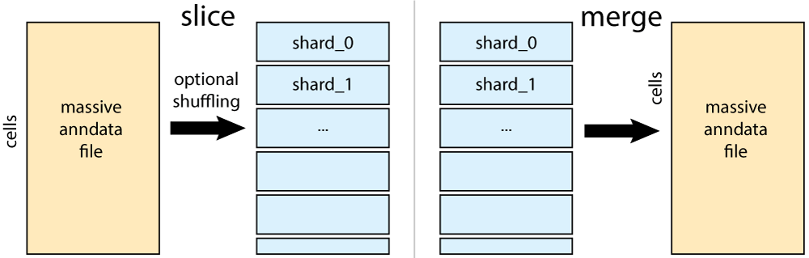

# annslicer

**Out-of-core sharding and merging of large AnnData files with minimal memory usage.**



Large single-cell datasets stored as `.h5ad` or `.zarr` files can easily exceed available RAM. `annslicer` slices them into manageable shards — and merges them back — without loading full matrices into memory. It uses best practices from `anndata` with a few small speed improvements for random shuffling.

Consolidates best practices into a simple command-line tool.

```bash
annslicer slice input.h5ad output_prefix
```

```bash
annslicer merge output.h5ad shard_0.h5ad shard_1.h5ad
```

## Features

- Shards and merges `X`, all `layers`, `obs`, `var`, `obsm`, and `uns`
- Handles both dense and sparse (CSR) matrices
- Constant, low memory footprint regardless of file size
- Input supports both `.h5ad` and `.zarr` formats for slicing
- Merge output supports both `.h5ad` and `.zarr` formats
- Optional **cell shuffling** (`--shuffle`) for representative shards without loading the full matrix
- Simple CLI and Python API

## Installation

```bash
pip install annslicer
```

For Zarr input/output support (optional):

```bash
pip install annslicer[zarr]
```

## CLI Usage

`annslicer` provides two subcommands: `slice` and `merge`.

### Sharding a large file

```bash
annslicer slice input.h5ad output_prefix --size 10000
```

Both `.h5ad` and `.zarr` inputs are supported.

| Argument | Description |
|---|---|
| `input.h5ad` or `input.zarr` | Path to the source file |
| `output_prefix` | Prefix for output files (e.g. `atlas` → `atlas_shard001.h5ad`, …) |
| `--size N` | Number of cells per shard (default: `10000`) |
| `--shuffle` | Randomly assign cells to shards (each shard is a representative draw) |
| `--seed N` | Random seed for reproducible shuffling (requires `--shuffle`) |

**Example — basic sharding:**

```bash
annslicer slice /data/large_atlas.h5ad /outputs/atlas --size 20000
```

**Example — shuffled sharding from a large h5ad:**

```bash
annslicer slice /data/large_atlas.h5ad /outputs/atlas --size 10000 --shuffle --seed 0
```

Produces: `atlas_shard_0.h5ad`, `atlas_shard_1.h5ad`, …

### Merging shards back into one file

```bash
annslicer merge output.h5ad shard_0.h5ad shard_1.h5ad shard_2.h5ad
```

Output format is inferred from the extension — use `.zarr` for Zarr output (requires `annslicer[zarr]`):

```bash
annslicer merge output.zarr shard_0.h5ad shard_1.h5ad shard_2.h5ad
```

### Global options

| Flag | Description |
|---|---|
| `--debug` | Enable verbose debug-level logging |

## Python API

```python
from annslicer import shard_h5ad, merge_out_of_core

# Basic sharding (h5ad or zarr input)
shard_h5ad("large_atlas.h5ad", "atlas", shard_size=20000)
shard_h5ad("large_atlas.zarr", "atlas", shard_size=20000)  # requires annslicer[zarr]

# Shuffled sharding — cells are randomly distributed across shards
shard_h5ad("large_atlas.h5ad", "atlas", shard_size=20000, shuffle=True, seed=0)

# Merge shards back into one file
merge_out_of_core(["atlas_shard_0.h5ad", "atlas_shard_1.h5ad"], "merged.h5ad")
```

## How it works

### Slicing
1. Opens the input file ("backed" AnnData for `.h5ad`; `anndata.io.sparse_dataset` for `.zarr`).
2. If `shuffle=True`, generates a global cell permutation upfront using `numpy.random.default_rng`.
3. For each shard, reads only the relevant rows from `X` and each layer via sorted fancy indexing — no full matrix is ever loaded into memory.
4. When shuffling, rows are read in sorted index order (maximising sequential I/O) and then reordered in-memory to the desired shuffled order.
5. Reassembles a valid `AnnData` object per shard and writes it to disk.

### Merging
1. Reads `obs`, `var`, and `uns` from the shards to build a skeleton output file.
2. Scans shards to calculate total non-zero sizes for pre-allocation.
3. Streams `X`, layers, and `obsm` data shard-by-shard directly into the pre-allocated output arrays.

> **Note:** CSC (column-compressed) sparse matrices are not supported for out-of-core row-slicing. Convert to CSR before sharding.

## Benchmarks

Run on a dummy sparse anndata object with 200k cells and 10k genes.

### For h5ad format

| Slicing method | Mean runtime (s) | Peak memory (MB) |
|---|---|---|
| `annslicer slice` | 0.584 | 211.4 |
| `anndata` backed | 0.601 | 203.7 |
| `annslicer slice --shuffle` | 1.731 | 221.8 |
| `anndata` backed with shuffle | 3.830 | 209.1 |

### For zarr format

| Slicing method | Mean runtime (s) | Peak memory (MB) |
|---|---|---|
| `annslicer slice` | 1.050 | 62.1 |
| `anndata` backed | 0.799 | 54.4 |
| `annslicer slice --shuffle` | 5.544 | 142.9 |
| `anndata` backed with shuffle | 6.591 | 151.4 |

Based on these benchmarks, for making randomly shuffled data shards, we recommend using `annslicer slice --shuffle` on an h5ad format file.

## License

BSD 3-clause
