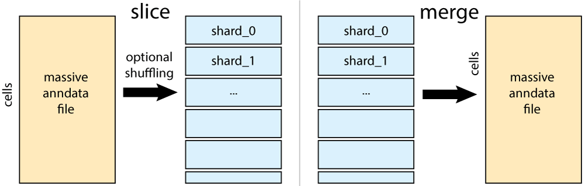

# annslicer

**Out-of-core sharding and merging of large AnnData files with minimal memory usage.**

[](LICENSE.md)
[](https://pypi.org/project/annslicer)
[](https://pepy.tech/project/annslicer)
[](https://github.com/cellarium-ai/annslicer/stargazers)



Large single-cell datasets stored as `.h5ad` or `.zarr` files can easily exceed available RAM. `annslicer` filters them, slices them into manageable shards and merges them back — without loading full matrices into memory. It uses best practices from `anndata` with a few small speed improvements for random shuffling.

Consolidates best practices into a simple command-line tool.

```bash
annslicer slice input.h5ad output_prefix --size 10000
```

```bash
annslicer slice input.h5ad output_prefix --obs-column cell_type
```

```bash
annslicer filter input.h5ad filtered.h5ad --obs-column keep
```

```bash
annslicer merge output.h5ad shard_*.h5ad
```

## Features

- Shards, filters, and merges `X`, all `layers`, `obs`, `var`, `obsm`, and `uns`
- Handles both dense and sparse (CSR) matrices
- Constant, low memory footprint regardless of file size
- Input supports both `.h5ad` and `.zarr` formats for slicing and filtering
- Merge output supports both `.h5ad` and `.zarr` formats
- **Fixed-size sharding** (`--size`) with optional random cell shuffling
- **Categorical sharding** (`--obs-column`) — one shard per category value, named by category
- **Always-include cells** — append control cells (e.g. non-targeting controls) to every shard
- **Auxiliary CSV metadata** — provide extra `obs` columns from a CSV file without modifying the source
- **Cell filtering** — keep only cells matching a boolean obs column, out-of-core
- Simple CLI and Python API

## Installation

```bash
pip install annslicer
```

For Zarr input/output support (optional):

```bash
pip install annslicer[zarr]
```

## CLI Usage

`annslicer` provides three subcommands: `slice`, `filter`, and `merge`.

### Sharding a large file

`annslicer slice` supports two sharding modes: fixed-size (default) and categorical.

#### Fixed-size sharding

Split the file into equal-sized shards by cell count:

```bash
annslicer slice input.h5ad output_prefix --size 10000
```

Both `.h5ad` and `.zarr` inputs are supported.

| Argument | Description |
|---|---|
| `input.h5ad` or `input.zarr` | Path to the source file |
| `output_prefix` | Prefix for output files (e.g. `atlas` → `atlas_shard_0.h5ad`, …) |
| `--size N` | Number of cells per shard (default: `10000`) |
| `--shuffle` | Randomly assign cells to shards (each shard is a representative draw) |
| `--seed N` | Random seed for reproducible shuffling (requires `--shuffle`) |
| `--compression FILTER` | HDF5 compression filter for shard files (e.g. `gzip`, `lzf`); default: no compression |

**Example — basic sharding:**

```bash
annslicer slice /data/large_atlas.h5ad /outputs/atlas --size 20000
```

**Example — shuffled sharding:**

```bash
annslicer slice /data/large_atlas.h5ad /outputs/atlas --size 10000 --shuffle --seed 0
```

**Example — gzip-compressed shards:**

```bash
annslicer slice /data/large_atlas.h5ad /outputs/atlas --size 10000 --compression gzip
```

Produces: `atlas_shard_0.h5ad`, `atlas_shard_1.h5ad`, …

#### Categorical sharding by obs column

Split cells into one shard per category value, named by the category:

```bash
annslicer slice input.h5ad output_prefix --obs-column cell_type
```

| Argument | Description |
|---|---|
| `--obs-column COLUMN` | Categorical obs column to partition on |
| `--csv-file PATH` | Optional CSV file with extra per-cell metadata (see below) |
| `--join-column COLUMN` | Column in the CSV to use as the cell-barcode key (default: first column) |
| `--always-include VALUE [VALUE ...]` | Category values to copy into **every** shard (e.g. non-targeting controls); no dedicated file is written for these categories |
| `--compression FILTER` | HDF5 compression filter; default: no compression |

The `--obs-column` column must be a pandas `Categorical`. If the column comes from `--csv-file`, it is coerced to categorical automatically.

**Example — shard a perturbation dataset by perturbation, including controls in every shard:**

```bash
annslicer slice perturb.h5ad /outputs/perturb \
    --obs-column perturbation \
    --always-include non-targeting
```

Produces: `perturb_KRAS.h5ad`, `perturb_TP53.h5ad`, … (one file per non-control perturbation, each containing the perturbation's cells plus all `non-targeting` cells).

**Example — obs column from an auxiliary CSV:**

```bash
annslicer slice atlas.h5ad /outputs/atlas \
    --obs-column tissue \
    --csv-file metadata.csv
```

The CSV must contain one row per cell. Its first column (or `--join-column`) is matched to the h5ad obs index. All CSV columns are coerced to categorical.

### Filtering cells

Produce a single output file containing only cells for which a boolean obs column is `True`:

```bash
annslicer filter input.h5ad filtered.h5ad --obs-column keep
```

| Argument | Description |
|---|---|
| `input_file` | Path to the source `.h5ad` or `.zarr` file |
| `output_file` | Path for the filtered output `.h5ad` file |
| `--obs-column COLUMN` | *(required)* Column whose truthy values determine which cells to keep |
| `--csv-file PATH` | Optional CSV file with extra per-cell metadata |
| `--join-column COLUMN` | Column in the CSV to use as the cell-barcode key (default: first column) |
| `--compression FILTER` | HDF5 compression filter; default: no compression |

The filter column is interpreted leniently: `bool` dtype is used directly; numeric columns treat non-zero as `True`; string columns accept `"true"`/`"false"`/`"1"`/`"0"` (case-insensitive).

**Example — filter using a pre-existing obs column:**

```bash
annslicer filter atlas.h5ad atlas_qc_pass.h5ad --obs-column qc_pass
```

**Example — filter using a column from an auxiliary CSV:**

```bash
annslicer filter atlas.h5ad atlas_filtered.h5ad \
    --obs-column keep \
    --csv-file cell_flags.csv
```

### Merging shards back into one file

```bash
annslicer merge output.h5ad shard_0.h5ad shard_1.h5ad shard_2.h5ad
```

Output format is inferred from the extension — use `.zarr` for Zarr output (requires `annslicer[zarr]`):

```bash
annslicer merge output.zarr shard_0.h5ad shard_1.h5ad shard_2.h5ad
```

Input files can also be specified as glob patterns (expanded lexicographically):

```bash
annslicer merge output.h5ad "shards/atlas_shard_*.h5ad"
```

| Argument | Description |
|---|---|
| `output_file` | Path for the merged output file (`.h5ad` or `.zarr`) |
| `input_files` | One or more shard paths or glob patterns, in order |
| `--join {inner,outer}` | How to join var (gene) axes when files differ (default: `outer`) |

When shards have **different gene sets**, `--join outer` (default) takes the union of all genes and fills missing entries with zeros; `--join inner` keeps only genes present in every shard. Layers absent from any shard are always dropped.

### Global options

| Flag | Description |
|---|---|
| `--debug` | Enable verbose debug-level logging |

## Python API

```python
from annslicer import shard_h5ad, shard_by_obs_column, filter_h5ad, merge_out_of_core

# --- Fixed-size sharding ---

# Basic sharding (h5ad or zarr input)
shard_h5ad("large_atlas.h5ad", "atlas", shard_size=20000)
shard_h5ad("large_atlas.zarr", "atlas", shard_size=20000)  # requires annslicer[zarr]

# Shuffled sharding — cells are randomly distributed across shards
shard_h5ad("large_atlas.h5ad", "atlas", shard_size=20000, shuffle=True, seed=0)

# Gzip-compressed shards — smaller files at the cost of write speed
shard_h5ad("large_atlas.h5ad", "atlas", shard_size=20000, compression="gzip")

# Custom output filenames — provide explicit paths instead of auto-generated names
shard_h5ad(
    "large_atlas.h5ad",
    "atlas",  # ignored when output_filenames is provided
    shard_size=20000,
    output_filenames=["batch_0.h5ad", "batch_1.h5ad", "batch_2.h5ad"],
)

# --- Categorical sharding by obs column ---

# Shard by a categorical obs column — one file per category, named by category value
shard_by_obs_column("atlas.h5ad", "atlas", obs_column="tissue")
# Produces: atlas_brain.h5ad, atlas_liver.h5ad, atlas_lung.h5ad, …

# Perturbation dataset — include control cells in every shard
shard_by_obs_column(
    "perturb.h5ad",
    "perturb",
    obs_column="perturbation",
    always_include=["non-targeting"],
)

# Obs column from an auxiliary CSV (coerced to categorical automatically)
shard_by_obs_column(
    "atlas.h5ad",
    "atlas",
    obs_column="tissue",
    csv_file="metadata.csv",  # first column matched to obs index
)

# --- Filtering ---

# Keep only cells where obs column is truthy (bool, 0/1, or 'True'/'False' strings)
filter_h5ad("atlas.h5ad", "atlas_qc.h5ad", obs_column="qc_pass")

# Filter using a boolean column from an auxiliary CSV
filter_h5ad("atlas.h5ad", "atlas_filtered.h5ad", obs_column="keep", csv_file="flags.csv")

# --- Merging ---

# Merge shards back into one file (identical-var fast path used automatically)
merge_out_of_core(["atlas_shard_0.h5ad", "atlas_shard_1.h5ad"], "merged.h5ad")

# Merge shards with different gene sets — outer join (union, fills absent genes with 0)
merge_out_of_core(["shard_a.h5ad", "shard_b.h5ad"], "merged.h5ad", join="outer")

# Merge shards with different gene sets — inner join (intersection only)
merge_out_of_core(["shard_a.h5ad", "shard_b.h5ad"], "merged.h5ad", join="inner")
```

## How it works

### Fixed-size slicing
1. Opens the input file ("backed" AnnData for `.h5ad`; `anndata.io.sparse_dataset` for `.zarr`).
2. If `shuffle=True`, generates a global cell permutation upfront using `numpy.random.default_rng`.
3. For each shard, reads only the relevant rows from `X` and each layer via sorted fancy indexing — no full matrix is ever loaded into memory.
4. When shuffling, rows are read in sorted index order (maximising sequential I/O) and then reordered in-memory to the desired shuffled order.
5. Reassembles a valid `AnnData` object per shard and writes it to disk.

### Categorical slicing
1. Opens the input file in the same backed/lazy mode as fixed-size slicing.
2. If `--csv-file` is provided, reads the CSV and merges it into `adata.obs` in memory (the backing file is never written to). All new columns are coerced to categorical.
3. Validates that the target column is categorical. Validates that any `--always-include` values exist in the category list.
4. Sanitises category names to safe filename fragments (`re.sub(r'[^\w.-]', '_', name)`); raises an error if two names collide after sanitisation.
5. For each non-always-include category: collects cell indices via `numpy.where`, appends always-include indices, sorts for sequential I/O, then writes. Empty categories are skipped with a warning.

### Filtering
1. Opens the input file in backed/lazy mode.
2. Optionally merges an auxiliary CSV into `adata.obs` (same merge logic as categorical slicing).
3. Reads the filter column and coerces it to boolean leniently (bool → direct; numeric → non-zero; string → `'true'`/`'false'`/`'1'`/`'0'`).
4. Collects the indices of cells where the column is `True` and writes them to a new file.

### Merging
1. Reads `obs`, `var`, and `uns` from **all** shards to build a skeleton output file.
2. Computes the merged `var` index: union (outer join) or intersection (inner join) of gene sets across all shards. If every shard shares the identical `var`, remapping is skipped entirely (fast path).
3. Scans shards to calculate total non-zero sizes for pre-allocation (for an inner join, entries for excluded genes are filtered during the scan).
4. Streams `X`, layers, and `obsm` data shard-by-shard directly into the pre-allocated output arrays, remapping column indices on the fly where needed.
5. Layers absent from any shard are dropped so every cell has consistent layer coverage.

> **Note:** CSC (column-compressed) sparse matrices are not supported for out-of-core row-slicing. Convert to CSR before sharding.

## Benchmarks

Run on a dummy sparse anndata object with 200k cells and 10k genes.

### For h5ad format

| Slicing method | Mean runtime (s) | Peak memory (MB) |
|---|---|---|
| `annslicer slice` | 0.584 | 211.4 |
| `anndata` backed | 0.601 | 203.7 |
| `annslicer slice --shuffle` | 1.731 | 221.8 |
| `anndata` backed with shuffle | 3.830 | 209.1 |

### For zarr format

| Slicing method | Mean runtime (s) | Peak memory (MB) |
|---|---|---|
| `annslicer slice` | 1.050 | 62.1 |
| `anndata` backed | 0.799 | 54.4 |
| `annslicer slice --shuffle` | 5.544 | 142.9 |
| `anndata` backed with shuffle | 6.591 | 151.4 |

Based on these benchmarks, for making randomly shuffled data shards, we recommend using `annslicer slice --shuffle` on an h5ad format file.

## License

BSD 3-clause
